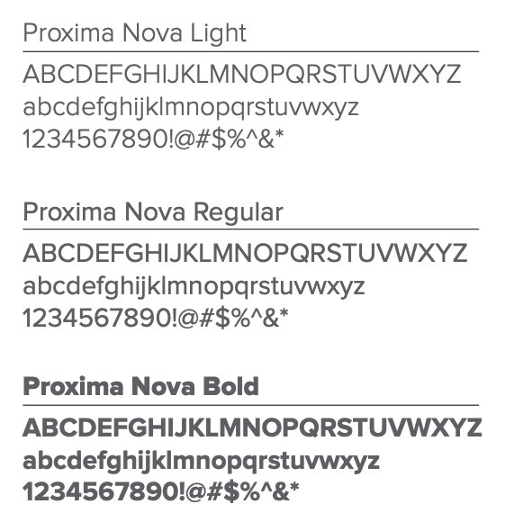

# Core Fonts for New York State Applications

## Guidelines

These font files and code snippets are provided to help you build applications that are consistent with the NYS brand. This is meant to be a guide for new application builds.

If you have any questions, please contact the NYS ITS UX Team.

The App Style Guide: https://on.ny.gov/AppStyleGuide

## Fonts
### Proxima Nova

Proxima Nova is New York State's primary font. It should be used as the typeface for navigation, navigation elements, and all other text within the applications (e.g. buttons, labels, etc). 



### D Sari

D Sari (Bold) is closely associated with the NYS brand. It is used on the NY State brand mark, identifier, and tagline. 

The only other place it should be used is for agency, program, and initiative titles when represented in lock-ups with the NY State brand mark. In applications, it should be used for Agency and Application names in the header and footer.


## Usage

To include the fonts in your application, include them using `@font-face` rule in your CSS file:

```css
/* Proxima Nova: Regular */

@font-face {
    font-family: 'Proxima Nova';
    src: url('../fonts/proximanova-regular.woff') format('woff'),
         url('../fonts/proximanova-regular.woff2') format('woff2');
    font-weight: normal;
    font-style: normal;
    font-display: swap;
}

/* Proxima Nova: Bold */

@font-face {
    font-family: 'Proxima Nova';
    src: url('../fonts/proximanova-bold.woff') format('woff'),
         url('../fonts/proximanova-bold.woff2') format('woff2');
    font-weight: bold;
    font-style: normal;
    font-display: swap;
}

/* ... THE REST OF THE FONTS ... */
```
Be sure to update the url path to reflect the location of the font files in your application.

Once loaded, you can then use them in your CSS:

```css
html {
  font-family: 'Proxima Nova', 'Helvetica Neue', Helvetica, Arial, sans-serif;
}
```
[View the full CSS file →](css/nys-fonts.css)

[View an HTML demo →](index.html)

## Font Files

[View the web font files →](fonts/)

For non-web applications, the full font files are available from the NYS SharePoint: https://on.ny.gov/Fonts

⚠️ These fonts have been licensed by New York State and are available only for use in New York State applications.